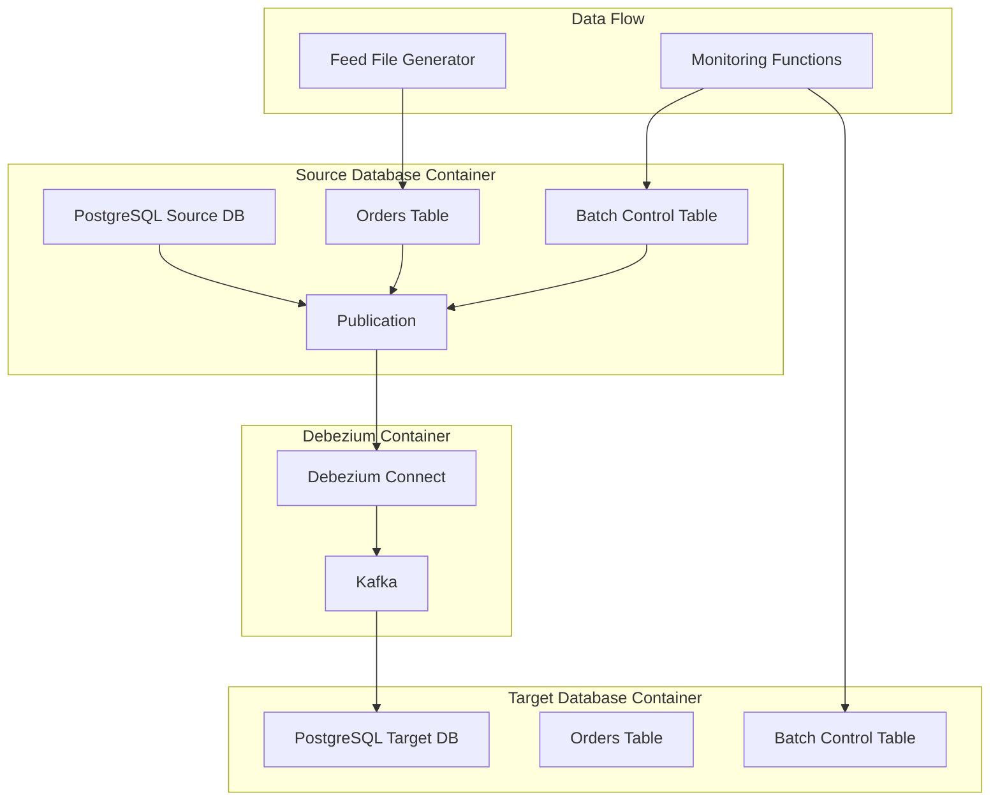

# PostgreSQL CDC Architecture with Debezium

## Components

1. **Source PostgreSQL Database**
   - Orders table (order_id, customer_id, amount, timestamp)
   - Batch control table (as per SQL)
   - Logical replication enabled
   - Publication for CDC

2. **Debezium Setup**
   - Debezium PostgreSQL Connector
   - Kafka for message streaming
   - Configuration for LSN tracking

3. **Target PostgreSQL Database**
   - Matching orders table
   - Matching batch control table
   - Replication slot

4. **Monitoring**
   - Batch replication status functions
   - LSN tracking and verification
   - Health status monitoring

## Data Flow

1. Feed file generator creates order data
2. Data is inserted into source orders table
3. Batch control records insertion with LSN
4. Debezium captures changes via logical replication
5. Changes are streamed through Kafka
6. Target database receives and applies changes
7. Monitoring functions verify replication status