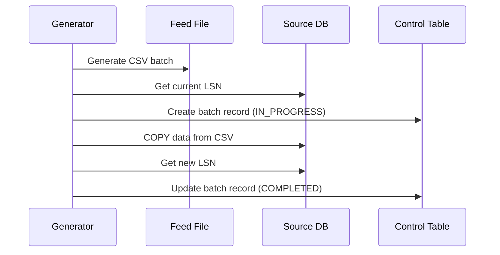

# Order Data Generator Design

## Overview
Python utility to generate test order data in CSV format and load it into the source PostgreSQL database while tracking LSNs for CDC verification.



## Components

### 1. Configuration
```python
config = {
    'batch_size': 100,  # Orders per batch
    'output_dir': './feed_files',
    'db_connection': {
        'host': 'localhost',
        'port': 5432,
        'database': 'sourcedb',
        'user': 'sourceuser',
        'password': 'sourcepass'
    }
}
```

### 2. Data Generation Functions
```python
def generate_order_data(batch_size: int) -> List[Dict]:
    """
    Generate random order data with:
    - order_id: auto-incrementing
    - customer_id: random int (1-1000)
    - amount: random decimal (10.00-1000.00)
    - timestamp: current time
    """

def create_csv_batch(orders: List[Dict], filename: str):
    """Create CSV file with order data"""
```

### 3. Database Operations
```python
def get_current_lsn(conn) -> str:
    """Get current PostgreSQL LSN"""
    
def create_batch_record(conn, batch_id: int) -> None:
    """Create IN_PROGRESS record in batch_control"""
    
def load_csv_to_database(conn, filename: str) -> None:
    """Load CSV using COPY command"""
    
def update_batch_completion(conn, batch_id: int, lsn: str) -> None:
    """Update batch_control with completion status and LSN"""
```

## Usage Example

```python
# Generate and load a batch
batch_id = get_next_batch_id()
orders = generate_order_data(config['batch_size'])
filename = f"orders_batch_{batch_id}.csv"
create_csv_batch(orders, filename)

with get_db_connection() as conn:
    # Start batch
    start_lsn = get_current_lsn(conn)
    create_batch_record(conn, batch_id)
    
    # Load data
    load_csv_to_database(conn, filename)
    
    # Complete batch
    end_lsn = get_current_lsn(conn)
    update_batch_completion(conn, batch_id, end_lsn)
```

## File Structure

```
data-generator/
├── config.py           # Configuration settings
├── generator.py        # Data generation logic
├── db_operations.py    # Database operations
├── main.py            # Main execution script
└── feed_files/        # Generated CSV files
```

## Error Handling

1. Database Connection Errors
   - Retry logic for temporary connection issues
   - Clear error messages for configuration problems

2. CSV Operations
   - File permission checks
   - Disk space verification
   - CSV format validation

3. Batch Control
   - Transaction management
   - Rollback on failure
   - Error status in batch_control table

## Monitoring

1. Logging
   - Batch generation details
   - Database operation timing
   - Error tracking
   - LSN progression

2. Metrics
   - Batch sizes
   - Generation time
   - Load time
   - Success/failure rates

## Next Steps

1. Implement the Python script structure
2. Create configuration file
3. Implement data generation functions
4. Add database operations
5. Create main execution loop
6. Add error handling and logging
7. Test with source database
8. Verify LSN tracking